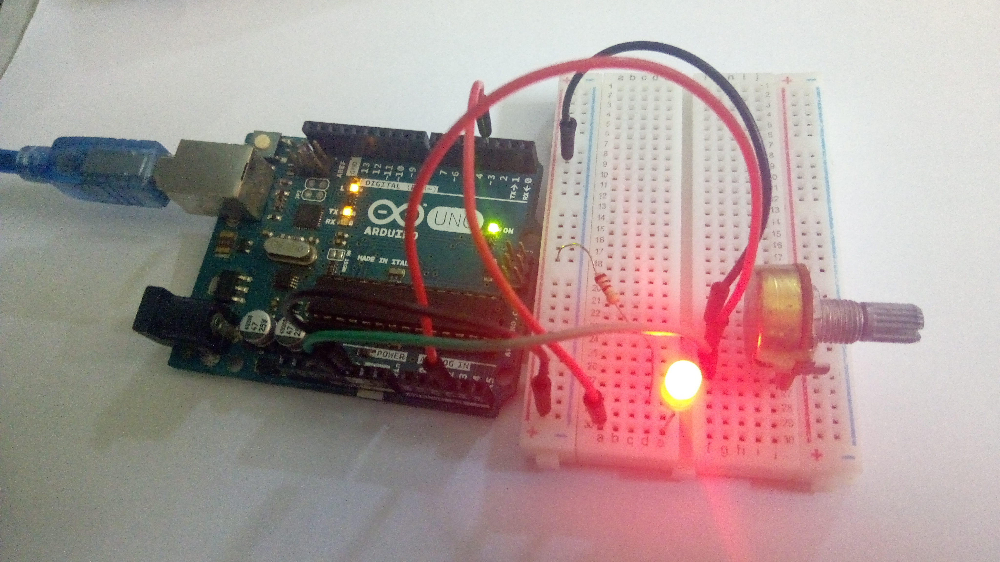

# Week 5 Examples (Analog Input)
## Example 1

Basic ADC application with potentiometer using default arduino library.

## Example 2

ADC application in On-Demand Mode.

## Example 3

ADC application in continuously running mode (auto-trigger).

VIDEO

https://youtu.be/_wRWIbiqB-M

CIRCUIT DIAGRAM

PROTOTYPE

